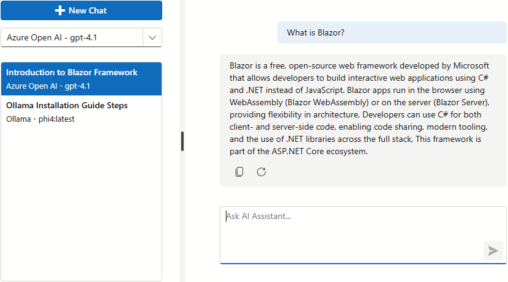

<!-- default badges list -->

[](https://supportcenter.devexpress.com/ticket/details/T1326784)
[](https://docs.devexpress.com/GeneralInformation/403183)
[](#does-this-example-address-your-development-requirementsobjectives)
<!-- default badges end -->
# Blazor AI Chat — Multi-Model Chat with Conversation History

This multi-model chat interface allows users to toggle between cloud LLMs and private (local) models within a single environment. Our sample project supports persistent chat threads with history management and automated title generation based on a user's initial prompt.



The sample app leverages the following DevExpress Blazor components:

- [DxAIChat](https://docs.devexpress.com/Blazor/DevExpress.AIIntegration.Blazor.Chat.DxAIChat)
- [DxSplitter](https://docs.devexpress.com/Blazor/DevExpress.Blazor.DxSplitter)
- [DxListBox](https://docs.devexpress.com/Blazor/DevExpress.Blazor.DxListBox-2)
- [DxComboBox](https://docs.devexpress.com/Blazor/DevExpress.Blazor.DxComboBox-2)
- [DxButton](https://docs.devexpress.com/Blazor/DevExpress.Blazor.DxButton)

## Setup and Configuration

To run this sample, configure project dependencies and set up secure authentication for the desired AI service.

### Required Packages

We use the following versions of Microsoft AI packages in this project:

| NuGet Package                                                                                    | Version                 |
| ------------------------------------------------------------------------------------------------ | ----------------------- |
| [Microsoft.Extensions.AI](https://www.nuget.org/packages/Microsoft.Extensions.AI)                | 9.7.1                   |
| [Microsoft.Extensions.AI.OpenAI](https://www.nuget.org/packages/Microsoft.Extensions.AI.OpenAI/) | 9.7.1-preview.1.25365.4 |
| [Microsoft.Extensions.AI.Ollama](https://www.nuget.org/packages/Microsoft.Extensions.AI.Ollama)  | 9.7.0-preview.1.25356.2 |
| [Azure.AI.OpenAI](https://www.nuget.org/packages/Azure.AI.OpenAI)                                | 2.2.0-beta.5            |

> [!NOTE]
> We cannot guarantee compatibility or correct execution with newer versions. Refer to the following announcement for additional information in this regard: [DevExpress.AIIntegration references stable versions of Microsoft AI packages](https://supportcenter.devexpress.com/ticket/details/t1292705/devexpress-aiintegration-references-stable-versions-of-microsoft-ai-packages).

### Register AI Services

> [!NOTE]  
> DevExpress AI-powered extensions follow the "bring your own key" principle. DevExpress does not offer a REST API and does not ship any built-in LLMs/SLMs. You need an active Azure/Open AI subscription to obtain the REST API endpoint, key, and model deployment name. These variables must be specified at application startup to register AI clients and enable DevExpress AI-powered Extensions in your application.

This example uses the following AI services:

| AI Provider                                                                         | Model                                          |
| ----------------------------------------------------------------------------------- | ---------------------------------------------- |
| [Azure OpenAI](https://azure.microsoft.com/en-us/products/ai-foundry/models/openai) | gpt-4.1                                        |
| Local [Ollama](https://ollama.com/) deployment                                      | [phi4:latest](https://ollama.com/library/phi4) |

For security reasons, secrets are stored in the [appsettings.json](CS/DXBlazorCompositeChatClientWithHistory/appsettings.json) file. Update the following sections with your own credentials:

- `OpenAISettings`
    - `Endpoint`: Your Azure OpenAI endpoint
    - `Key`: Your Azure OpenAI key
    - `DeploymentName`: Azure OpenAI [model ID](https://learn.microsoft.com/en-us/azure/ai-services/openai/concepts/models)
- `OllamaSettings`
    - `Uri`: Local Ollama API endpoint
    - `ModelName`: Local Ollama model

> **Note**
> Update `appsettings.Development.json` to test this example in your local development environment.

The following code in [Program.cs](CS/DXBlazorCompositeChatClientWithHistory/Program.cs) retrieves the provider API configuration. Modify this code if you prefer to keep keys in environment variables or User Secrets.

```csharp
var openAiServiceSettings = builder.Configuration.GetSection("OpenAISettings").Get<OpenAIServiceSettings>();
var ollamaSettings = builder.Configuration.GetSection("OllamaSettings").Get<OllamaSettings>();

// Register individual IChatClient instances as keyed scoped services
builder.Services.AddKeyedScoped<IChatClient>("azure-openai", (_, _) =>
    new AzureOpenAIClient(
            new Uri(openAiServiceSettings.Endpoint),
            new AzureKeyCredential(openAiServiceSettings.Key))
        .GetChatClient(openAiServiceSettings.DeploymentName)
        .AsIChatClient());

builder.Services.AddKeyedScoped<IChatClient>("ollama-phi4", (_, _) =>
    new OllamaChatClient(
        new Uri(ollamaSettings.Uri),
        ollamaSettings.ModelName,
        new HttpClient { Timeout = TimeSpan.FromMinutes(10) }));

// Assemble the composite client from keyed IChatClient services
builder.Services.AddScoped<CompositeChatClient>(provider => {
    var threadStore = provider.GetRequiredService<IChatThreadStore>();
    var titleGenerator = provider.GetRequiredService<IChatThreadTitleGenerator>();

    return new CompositeChatClient(
        threadStore,
        titleGenerator,
        new ChatClientSession(
            provider.GetRequiredKeyedService<IChatClient>("azure-openai"),
            "azure-openai",
            $"Azure Open AI - {openAiServiceSettings.DeploymentName}"),
        new ChatClientSession(
            provider.GetRequiredKeyedService<IChatClient>("ollama-phi4"),
            "ollama-phi4",
            $"Ollama - {ollamaSettings.ModelName}"));
});
```

## Implementation Details

This section introduces key code blocks used in the example and how they work together to deliver a complete AI chat experience.

### Layout

This application uses a [two-pane layout](CS/DXBlazorCompositeChatClientWithHistory/Components/Pages/Index.razor) with a [DxSplitter](https://docs.devexpress.com/Blazor/DevExpress.Blazor.DxSplitter) that separates the sidebar and chat pane.

CSS styles that define size and spacing for the splitter, sidebar, and chat component reside in [Index.razor.css](CS/DXBlazorCompositeChatClientWithHistory/Components/Pages/Index.razor.css).

### Multi-Model Chat

The application allows users to switch between cloud and local AI providers on-the-fly.

- [Program.cs](CS/DXBlazorCompositeChatClientWithHistory/Program.cs) integrates two named [ChatClientSession](CS/DXBlazorCompositeChatClientWithHistory/Services/ChatClientSession.cs) instances (Azure OpenAI and Ollama) and registers them in the [CompositeChatClient](CS/DXBlazorCompositeChatClientWithHistory/Services/CompositeChatClient.cs) object. [CompositeChatClient](CS/DXBlazorCompositeChatClientWithHistory/Services/CompositeChatClient.cs) implements the [IChatClient](https://learn.microsoft.com/en-us/dotnet/api/microsoft.extensions.ai.ichatclient) interface and forwards chat requests to the current session.
- [Index.razor](CS/DXBlazorCompositeChatClientWithHistory/Components/Pages/Index.razor) uses the [DxComboBox](https://docs.devexpress.com/Blazor/DevExpress.Blazor.DxComboBox-2) component bound to `CompositeChatClient.AvailableChatClients` and updates the selected session. Changing the model preserves existing chat history and continues the conversation with the newly selected model.
- Each thread stores model selection in the `ModelSessionId` property. Switching chat threads restores the model selection.

To support streaming responses, our chat implementation uses the default message pipeline without the [MessageSent](https://docs.devexpress.com/Blazor/DevExpress.AIIntegration.Blazor.Chat.DxAIChat.MessageSent) event override.

### Dynamic Title Generation

[CompositeChatClient](CS/DXBlazorCompositeChatClientWithHistory/Services/CompositeChatClient.cs) intercepts user prompts using `GetResponseAsync` / `GetStreamingResponseAsync`. The selected AI model [generates](CS/DXBlazorCompositeChatClientWithHistory/Services/IChatThreadTitleGenerator.cs) an automatic thread title (3–6 words) from the first user prompt in the background.

In case of failure, the first six words of the user message serve as the title.

### Conversation History

Each conversation thread is a [ChatThread](CS/DXBlazorCompositeChatClientWithHistory/Services/ChatThread.cs) object. It contains a list of messages and metadata that is used in the UI for titles and ordering. [Index.razor](CS/DXBlazorCompositeChatClientWithHistory/Components/Pages/Index.razor) calls the [SaveMessages](https://docs.devexpress.com/Blazor/DevExpress.AIIntegration.Blazor.Chat.DxAIChat.SaveMessages) method before switching threads and [LoadMessages](https://docs.devexpress.com/Blazor/DevExpress.AIIntegration.Blazor.Chat.DxAIChat.LoadMessages(System.Collections.Generic.IEnumerable-DevExpress.AIIntegration.Blazor.Chat.BlazorChatMessage-)) when a thread becomes active.

[InMemoryChatThreadStore](CS/DXBlazorCompositeChatClientWithHistory/Services/InMemoryChatThreadStore.cs) keeps chat history in a dictionary guarded by a lock for thread-safety:

- Creates new threads with a title, model session ID, and timestamps.
- Returns ordered threads.
- Saves messages, updates titles, and updates model session IDs.

Since thread state is stored in memory, all chat history is lost when the application restarts.

#### Persist Conversation History

To persist chat history when the application restarts, implement [IChatThreadStore](CS/DXBlazorCompositeChatClientWithHistory/Services/IChatThreadStore.cs) with a database-backed store (for example, EF Core). Then replace [InMemoryChatThreadStore](CS/DXBlazorCompositeChatClientWithHistory/Services/InMemoryChatThreadStore.cs) with your implementation in [Program.cs](CS/DXBlazorCompositeChatClientWithHistory/Program.cs):

```scharp
// Replace with your database-backed implementation
builder.Services.AddSingleton<IChatThreadStore, InMemoryChatThreadStore>();
```

## Files to Review

- [Program.cs](CS/DXBlazorCompositeChatClientWithHistory/Program.cs)
- [appsettings.json](CS/DXBlazorCompositeChatClientWithHistory/appsettings.json) (use `appsettings.Development.json` for your local development environment)
- [Index.razor](CS/DXBlazorCompositeChatClientWithHistory/Components/Pages/Index.razor)
- [Index.razor.css](CS/DXBlazorCompositeChatClientWithHistory/Components/Pages/Index.razor.css)
- [CompositeChatClient.cs](CS/DXBlazorCompositeChatClientWithHistory/Services/CompositeChatClient.cs)
- [ChatClientSession.cs](CS/DXBlazorCompositeChatClientWithHistory/Services/ChatClientSession.cs)
- [ChatThread.cs](CS/DXBlazorCompositeChatClientWithHistory/Services/ChatThread.cs)
- [IChatThreadStore.cs](CS/DXBlazorCompositeChatClientWithHistory/Services/IChatThreadStore.cs)
- [InMemoryChatThreadStore.cs](CS/DXBlazorCompositeChatClientWithHistory/Services/InMemoryChatThreadStore.cs)
- [IChatThreadTitleGenerator.cs](CS/DXBlazorCompositeChatClientWithHistory/Services/IChatThreadTitleGenerator.cs)
- [ChatThreadTitleGenerator.cs](CS/DXBlazorCompositeChatClientWithHistory/Services/ChatThreadTitleGenerator.cs)

## Documentation

- [DevExpress AI-powered Extensions for Blazor](https://docs.devexpress.com/Blazor/405228/ai-powered-extensions)
- [DevExpress Blazor AI Chat Control](https://docs.devexpress.com/Blazor/DevExpress.AIIntegration.Blazor.Chat.DxAIChat)
- [DevExpress Blazor Splitter](https://docs.devexpress.com/Blazor/DevExpress.Blazor.DxSplitter)
- [DevExpress Blazor List Box](https://docs.devexpress.com/Blazor/DevExpress.Blazor.DxListBox-2)

## Related Examples

- [Blazor AI Chat - How to add the DevExpress Blazor AI Chat component to your next Blazor, MAUI, WPF, and WinForms application](https://github.com/DevExpress-Examples/devexpress-ai-chat-samples)
- [Blazor AI Chat — Implement Function/Tool Calling](https://github.com/DevExpress-Examples/blazor-ai-chat-function-calling)
- [Rich Text Editor and HTML Editor for Blazor - How to integrate AI-powered extensions](https://github.com/DevExpress-Examples/blazor-ai-integration-to-text-editors)

<!-- feedback -->
## Does This Example Address Your Development Requirements/Objectives?

[](https://www.devexpress.com/support/examples/survey.xml?utm_source=github&utm_campaign=blazor-multi-model-ai-chat-with-history&~~~was_helpful=yes) [](https://www.devexpress.com/support/examples/survey.xml?utm_source=github&utm_campaign=blazor-multi-model-ai-chat-with-history&~~~was_helpful=no)

(you will be redirected to DevExpress.com to submit your response)
<!-- feedback end -->
